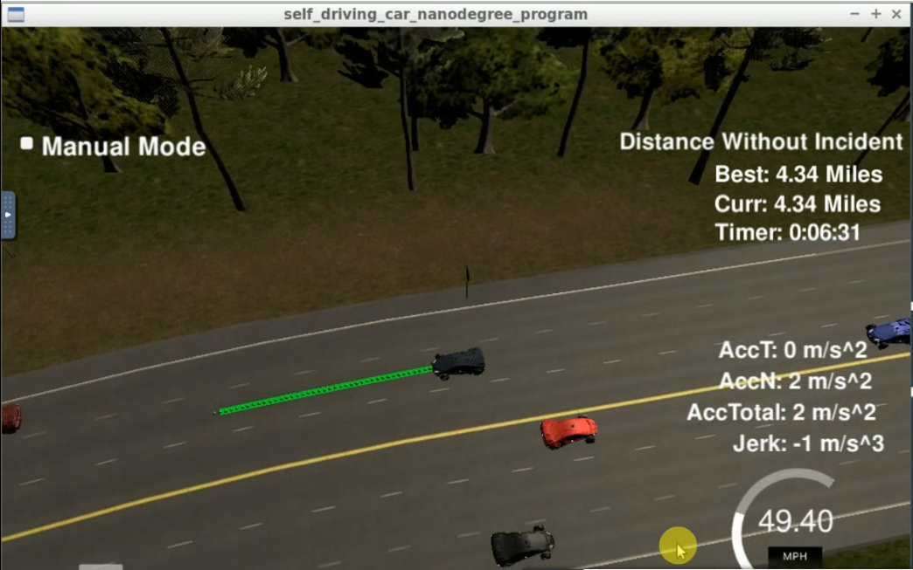

# Path Planning Project - Self Driving Car Nanodegree

### Model Documentation

Most of the code for this project is derived from the Q&A section in the Project Chapter.The main pipeline which is required to successfully maneuver   
the vehicle is present in the main() section. All the vehicle data is available from the JSON objects. This data includes x,y,s,d,yaw,speed,  
previous_path_x, previous_path_y, end_path_s, and sensor_fusion_data. For vehicle cognizance, the data about its surrounding is fetched from    
the JSON object variables. Since the cost function is not implemented for this project. This data is directly used for every iteration to understand  
the number of vehicles surrounding the ego vehicle. Based on this data, simple decision such as if vehicle is within 30 meters, its best to switch  
lanes is flagged, or to stay in the current lane if no obstacles are present are flagged. Since the maximum velocity and maximum jerk allowance is  
given to us directly, instead of implementation via a jerk minimization trajectory algorithm, simple linear variables were selected for velocity increments  
such that we never violate the limits, but which comes at a cost of a slow performance and unintelligent movement. A condition is also applied that  
whenever the vehicles present in the middle lane are within the safety threshold boundaries, then execute the lane change maneuver.  
  
Based on all these decisions the points generated are then again filtered considering the previous path points combined with coordinate transformation
and usage of spline instead of polynomial generation for creating a movable smooth trajectory. To make sure that the vehicle doesn't move slowly or get
stuck, the conditions are set such that the vehicle always attempts to reach the maximum threshold speed with small increments for avoiding high jerk.  
These points are then appended to the list of x,y trajectory points.  

### Failed Scenario

This happened when there were 3 vehicles in the lanes beside the ego vehicle in the front, where a lane change would be impossible to perform.   
And on the backside of the ego vehicle there were two vehicles, one in the same lane as ego vehicle and the other one in the middle lane. So the  
current algorithm slowed down in this scenario, but the slowing down of the ego vehicle resulted in getting rear-ended by the vehicles from behind.

